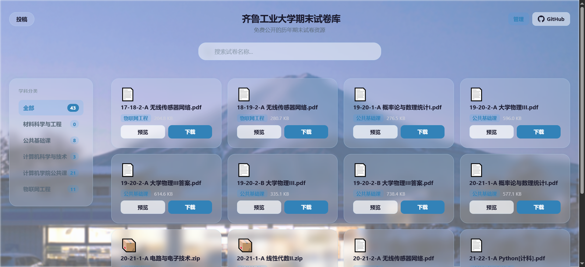

# 齐鲁工业大学期末试卷库

免费公开的历年期末试卷资源，支持在线浏览和 PDF 预览。



[网站](https://brainwangs.github.io/QLU_FinalExamPaper) · [试卷文件](./assets) · [投稿](mailto:brianwangx@163.com)

## 技术栈

Vue 3 + TypeScript + Vite，部署于 GitHub Pages，支持 Electron 桌面客户端。

## 项目结构

```
QLU_FinalExamPaper/
├── assets/                  ← 试卷文件（按学科分目录）
├── web/                     ← Vue 3 前端
│   ├── src/
│   │   ├── data/            ← 元数据（categories.json / files.json）
│   │   ├── views/           ← 页面（首页 + admin 管理后台）
│   │   ├── components/      ← 组件
│   │   ├── composables/     ← 组合式函数（搜索过滤、卡片倾斜）
│   │   ├── plugins/         ← Vite 插件（admin API）[仅开发模式]
│   │   └── utils/           ← 工具函数
│   ├── electron/            ← Electron 主进程
│   └── vite.config.ts       ← 构建配置
└── .github/workflows/       ← 自动部署
```

## 本地开发

```bash
cd web
npm install
npm run dev         # 启动开发服务器（含管理后台）
npm run build       # 生产构建
```

管理后台仅在开发模式或 Electron 客户端中可用。

## Electron 桌面客户端

```bash
cd web
npm run electron:start     # 启动
npm run electron:package   # 打包 .exe
```

## 功能

- 按学科分类浏览试卷
- 模糊搜索（Fuse.js）
- PDF 在线预览
- 深色模式（跟随系统 + 手动切换）
- 管理后台：上传、分类、删除试卷 [Electron / 开发模式]

## 投稿

欢迎分享试卷资源，发送至 [brianwangx@163.com](mailto:brianwangx@163.com)，标题注明考试学期和适用专业。

## License

免费公开分享，仅供学习参考。
